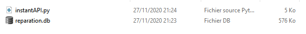
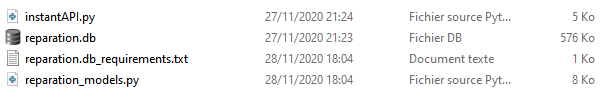
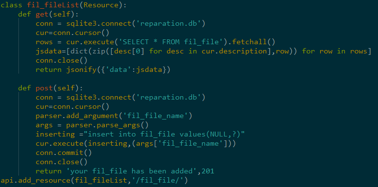

# instantAPI
## Description

A scripts that generates a fully functional flask api from databases;the script is ready to use in production environement right after it ; you can add yout jwt secutiry token and tweek some code but the rest is already there (sqlite3 for the moment and looking for contributers)       

## Dependencies

* * *

*   sqlite3
*   python3.x

## installation

* * *

no installation needed   

## usage

* * *

    python instantAPI.py link/to/your/sqlite3/database.db

## example

before execution:
  
after execution:
  

the reparation_models.py contains the api for your database (get and post methods for all tables)example of one table :  
  
the name of the classes are the name of the db table+List and the links have the same name as your databases  

for more examples make sure you test it your self or see the example folder
* * *

# Before using

make sure your databases’s tables all contains and auto incremental index .
